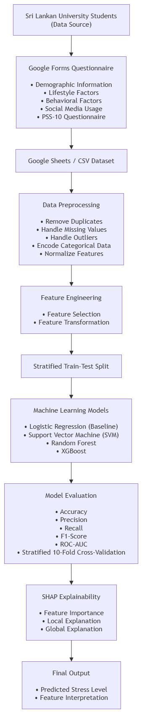

# Stress Prediction XAI

## Project Title

**A Comparative Explainable AI Framework for Stress Prediction Using Behavioral, Lifestyle, and Social Media Analytics Among Sri Lankan University Students**

---

## Overview

This repository contains the implementation and supporting resources for the research project titled **"A Comparative Explainable AI Framework for Stress Prediction Using Behavioral, Lifestyle, and Social Media Analytics Among Sri Lankan University Students."**

The project aims to develop an Explainable Artificial Intelligence (XAI)-based machine learning framework to predict stress levels among Sri Lankan university students using demographic, lifestyle, academic, behavioural, social media, and psychological factors. The framework integrates Explainable AI techniques to improve transparency and interpretability of the prediction results.

---

## Research Objective

To develop and evaluate an Explainable Artificial Intelligence (XAI)-based framework for predicting stress levels among Sri Lankan university students and identify the key factors that influence stress prediction.

---

## Features

- Data preprocessing
- Data cleaning
- Feature engineering
- Machine learning model development
- Comparative model evaluation
- Explainable AI using SHAP
- Stress prediction analysis
- Performance evaluation

---

## Project Structure

```text
stress-prediction-xai/
│
├── dataset/
│   ├── raw/
│   └── processed/
│
├── preprocessing/
│
├── models/
│
├── explainability/
│
├── notebooks/
│
├── results/
│
├── images/
│
├── README.md
├── requirements.txt
├── LICENSE
└── .gitignore
```

---

## Machine Learning Models

The following machine learning algorithms will be evaluated and compared:

- Logistic Regression
- Support Vector Machine (SVM)
- Random Forest
- XGBoost

The best-performing model will be selected based on standard evaluation metrics.

---

## Explainable Artificial Intelligence (XAI)

The selected machine learning model will be interpreted using **SHAP (SHapley Additive exPlanations)** to explain how each feature contributes to the predicted stress level. This improves model transparency, interpretability, and trustworthiness.

---

## Dataset

The dataset consists of questionnaire responses collected from Sri Lankan university students through a structured Google Form.

The questionnaire includes:

- Demographic Information
- Academic Factors
- Lifestyle Factors
- Behavioural Factors
- Social Media Usage
- Perceived Stress Scale (PSS-10)

The collected responses are exported as CSV files and processed before model training.

---

## Technologies

- Python
- Pandas
- NumPy
- Scikit-learn
- XGBoost
- SHAP
- Matplotlib
- Jupyter Notebook
- Google Forms

---

## Evaluation Metrics

The machine learning models will be evaluated using:

- Accuracy
- Precision
- Recall
- F1-Score
- ROC-AUC

Model validation will be performed using **Stratified 10-Fold Cross-Validation**.

---

## Current Status

- Repository Created
- Project Structure Completed
- Dataset Collection in Progress
- Data Preprocessing
- Milestone 2 Development Completed
- Model Development (Upcoming)
- SHAP Explainability (Upcoming)

---

## Proposed System Architecture

The following figure illustrates the overall workflow of the proposed Explainable AI-based Stress Prediction Framework.



**Figure 1. Proposed System Architecture of the Explainable AI-based Stress Prediction Framework**

---

## Repository

GitHub Repository:

**https://github.com/ISURUNIMESH/stress-prediction-xai**

---

## Project Team

**K I Nimesh**  
Student ID: **ITBIN-2313-0071**

**H A R Nawanjala**  
Student ID: **ITBIN-2313-0068**

---

## License

This project is licensed under the **MIT License**.

---

## Future Work

The repository will be continuously updated throughout the research project. Future updates will include:

- Data preprocessing implementation
- Exploratory Data Analysis (EDA)
- Machine learning model implementation
- Model comparison
- SHAP explainability analysis
- Experimental results
- Final research documentation
